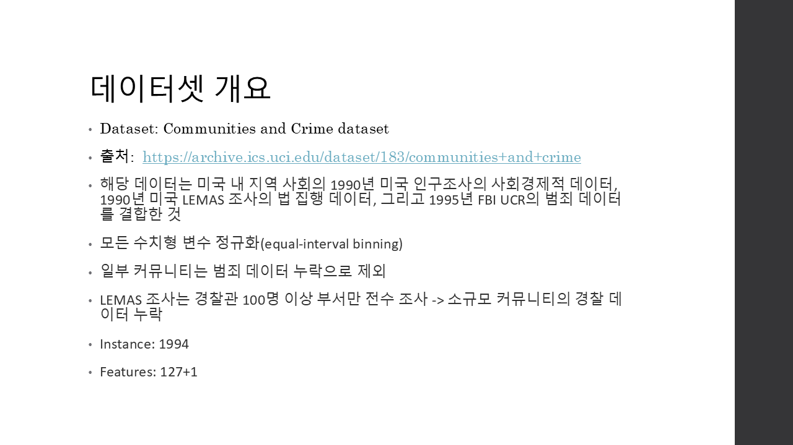
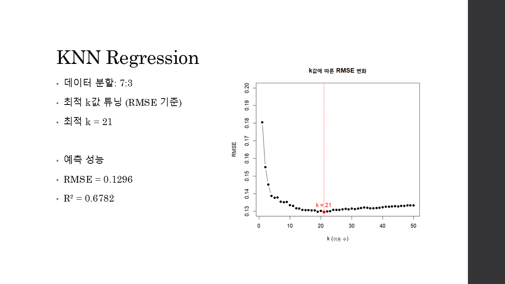
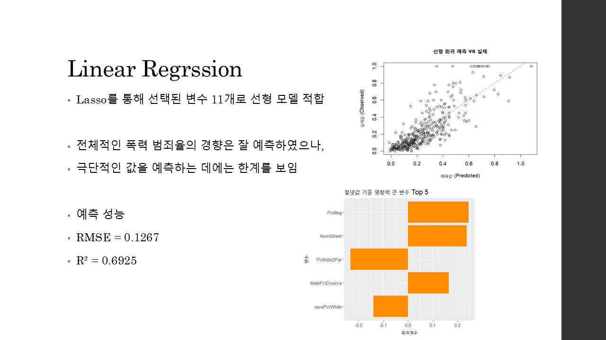
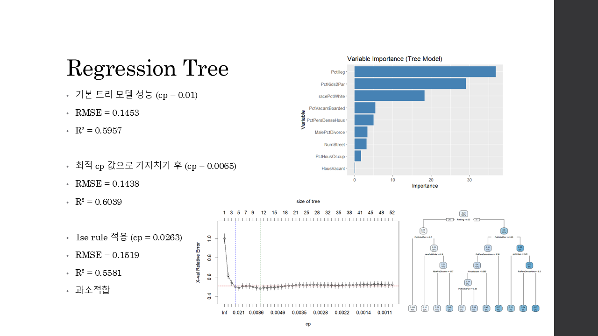
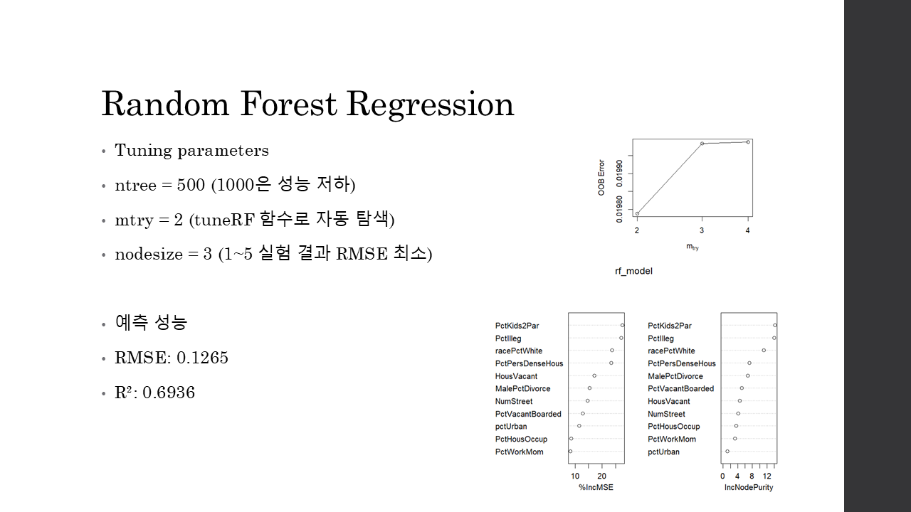

# 🇺🇸 미국 지역 특성을 활용한 폭력 범죄율 예측

## 📊 프로젝트 개요
미국 내 지역 사회의 미국 연구조사의 사회경제적 데이터, 법 집행 데이터, 범죄 데이터를 활용하여, 폭력 범죄율 예측을 위한 4가지 주요 머신러닝 회귀 모델의 적합 및 성능 비교 분석.

데이터셋: Communitites and Crime dataset  
출처: https://archive.ics.uci.edu/dataset/183/communities+and+crime

---

## 📈 주요 결론 요약

* **최적 모델 선정:** 4개의 모델 중 **Random Forest(RF)**가 `RMSE: 0.1265`, `R-squared: 0.6936`으로 타 모델 대비 가장 좋은 예측 성능

* **핵심 변수 발견:** 변수 중요도(Feature Importance) 분석 결과, **'미혼모 가정 아동 비율(`pct1lleg`)'**이 모든 모델에서 공통적으로 범죄율 예측에 가장 큰 영향을 미치는 변수로 확인

* **변수 영향 해석:** '미혼모 가정 아동 비율'이 **높을수록** 폭력 범죄율 또한 **높아지는** 경향성을 확인

---

## 🖼️ 프로젝트 발표 슬라이드

   
   
   

